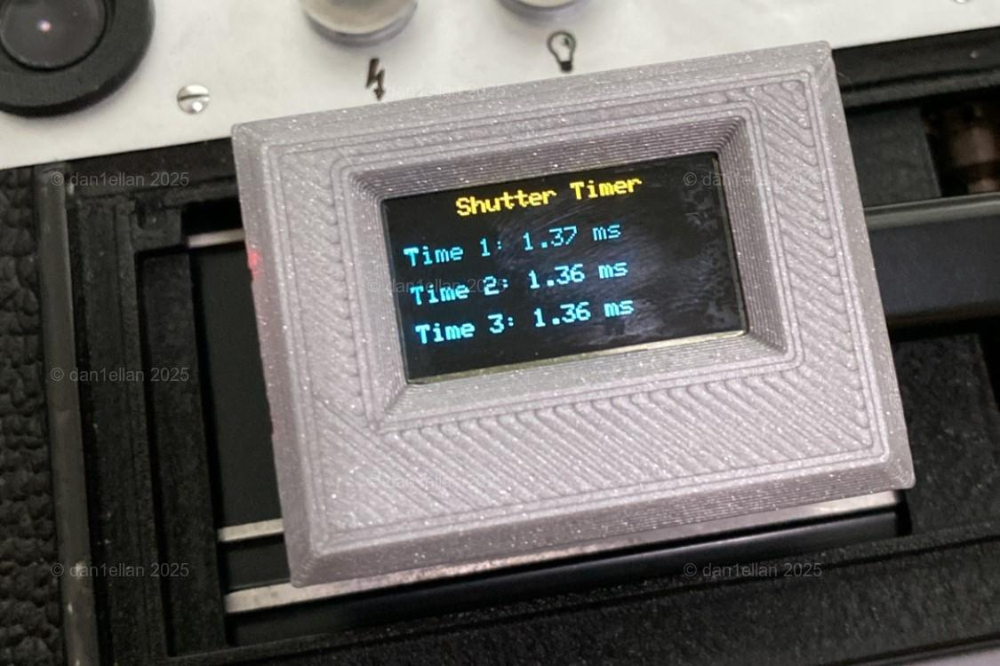
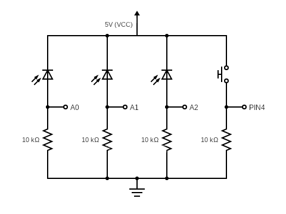
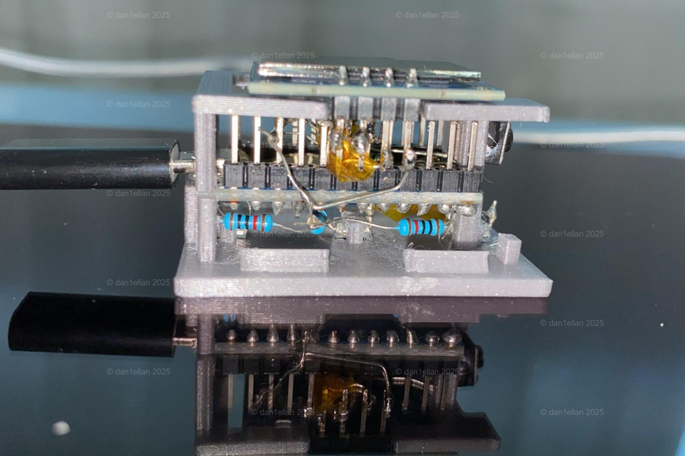
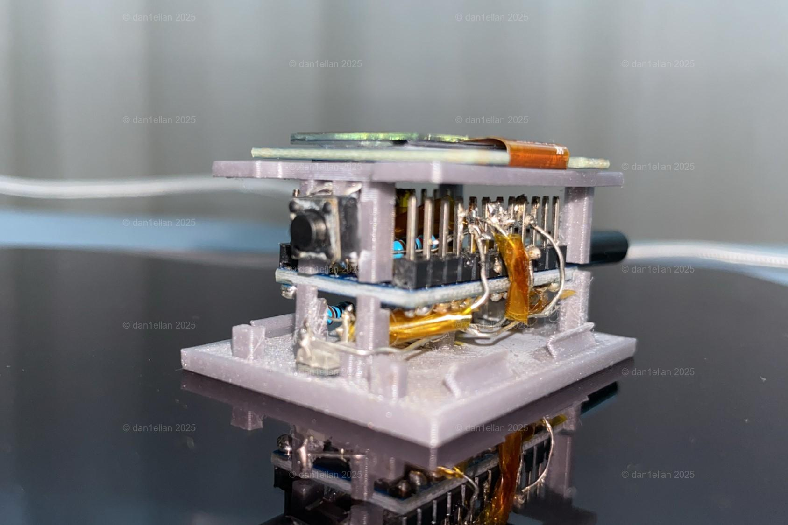
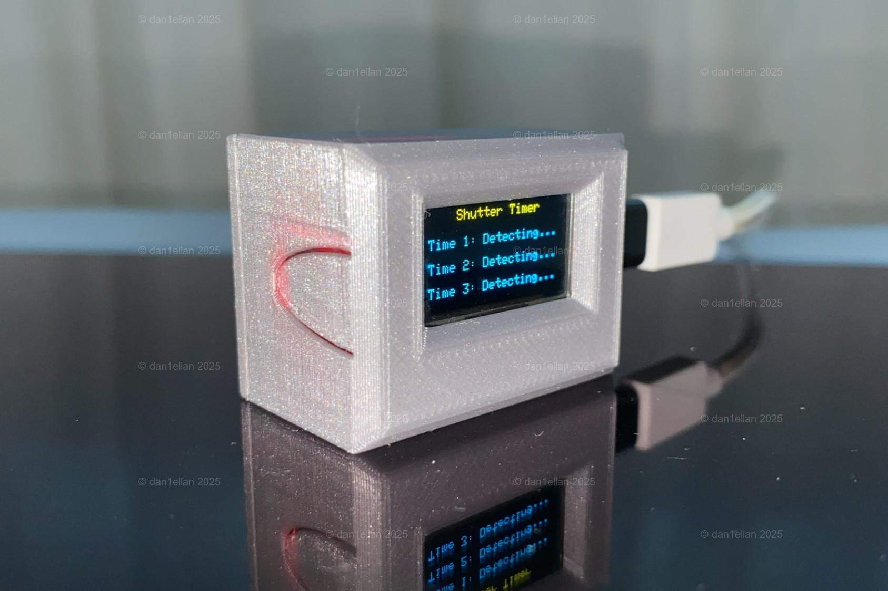
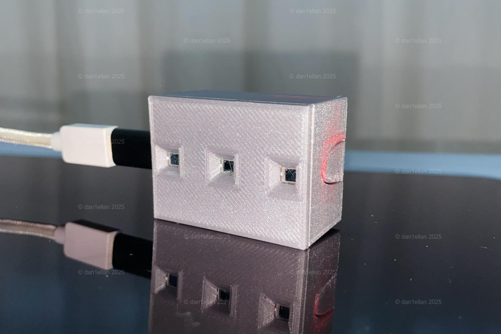
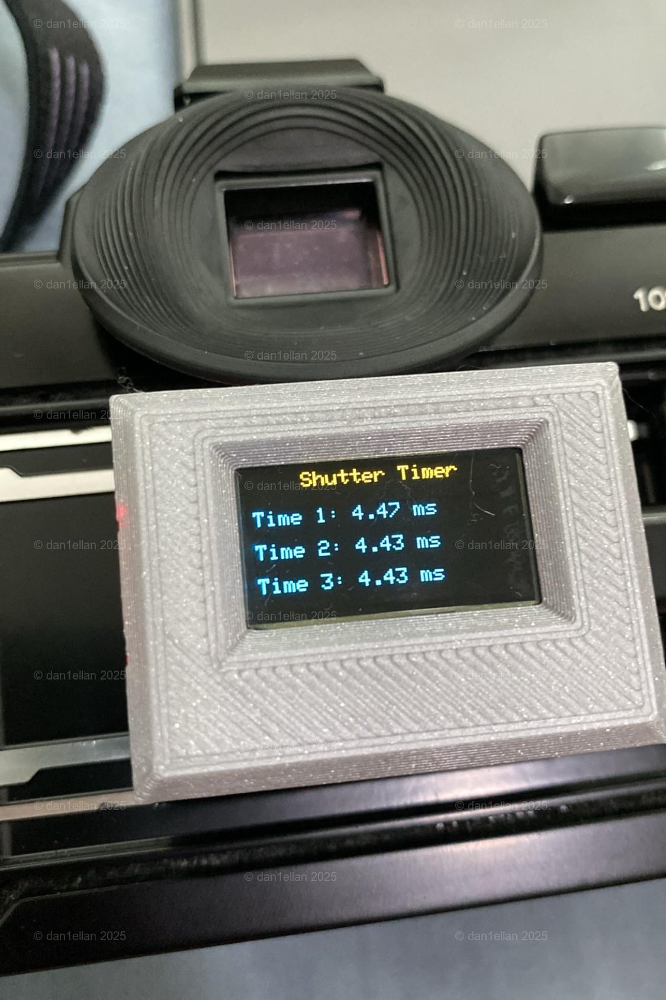
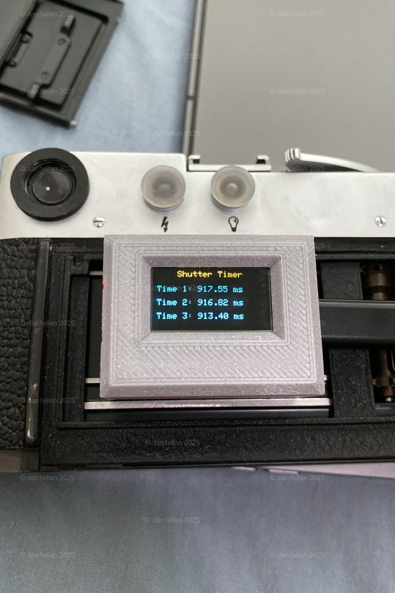

This shutter speed timer is built with Arduino Micro/Pro Micro and provides three readings of shutter speeds, it's a cheap and compact design that can measure down to 1/1000s. 

## Parts List
- 1 Pro Micro Board
- 3 BPW34 Photodiodes
- 1 SSD1306 OLED Display
- 1 Tactile Push Button
- 4 10k ohms resistors

## Building the Timer

The circuit is simple and straightforward.

For the photodiodes, I chose BPW34 for the fast rise/fall time, sensitivity to visible light, and small size. I wired them in reverse-bias. **Take note of the polarity, the cathode is marked with a small tip on the side**. From what I've read, an op-amp configuration could deliever better performance, but I don't have one, and it would've been more complicated and taken up more space.

The SSD1306 display is easy to wire up and code. Mine has four pins: VCC, GND, SDA, SCL. Simply refer to the board's pinout diagram for the correct pins. For my Pro Micro board, pin 2 is SDA, pin 3 is SCL. 

The push button is there to offer additional functionalities, I currently use it to simply reset and start a new measurement. Initially it was used to display the last recorded measurements, but I didn't find it very useful. 

I started off by building the circuit on a breadboard. Once I was happy with its performance, I built it into the 3D-printed case. I cut off some resistor legs to use as wires, and wrapped them with Kapton tape for insulation when needed. 

The cased assembly was built from the base plate up:
1. Place the three photodiodes over the windows and superglue their backsides to the prongs holding them. Solder the resistors and wires to them. 

2. Sit the Arduino board on top, solder the photodiodes' resistors and wires to the corresponding pins on the board. 

3. Solder the button to its wires and resistor, insert and superglue it into its seat on the side of spacer plate. Then place the spacer plate on top of Arduino board. Here wrapping the assembly with some masking tape can help keep everything aligned before soldering. Solder the button connections to the board pins.

4. Solder the wires for the display to the Arduino pins, the other ends of the wires need to be placed where the display pins would sit under the spacer plate's open slot.

5. Sit the display on top of the spacer plate and solder the four connections.

6. Fit the case top over the assembly, press them together to engage the snap fit between base plate and case top.

Because the USB port on the Pro Micro is fragile, I use a USB extension port to avoid plugging into the board directly.

## Code

The code was written in Arduino IDE, I also ported it to PlatformIO on VSCode. 

There are three states for each photodiode: 

1. `DETECTING`: 
   I used `analogRead()` and a threshold value to detect light falling on photodiodes, once reading exceeds threshold, light is detected, the start time is recorded and state changes to `MEASURING`.
2. `MEASURING`:
   Once reading from `analogRead()` drops below threshold, the duration of exposure can be calculated by subtracting the start time from the current time. The state changes to `RESULT`.
3. `RESULT`: 
   When all three photodiodes are in this state, the timed durations are displayed in milliseconds with a timeout of 10 seconds. After which the states reset back to `DETECTING`.

**Notes**: To be able to measure down to 1 ms, the `DETECTING` and `MEASURING` cycle should be enclosed in a while loop without any slow operations, like `println`.

## Testing on Cameras
To use the timer, power it on via USB, open the camera back, press it up against the film rails, make sure the photodiodes are aligned with the edges of film gate, shine a flashlight from the lens mount towards the film gate. Reset the timer, then fire the shutter and check the displayed readings.

I have tested on my Leica M3 and Canon A1 with lens off. It doesn't seem to work as well with lens on. I'm not sure why, maybe I need to use a better light source than my iPad's flashlight. 

